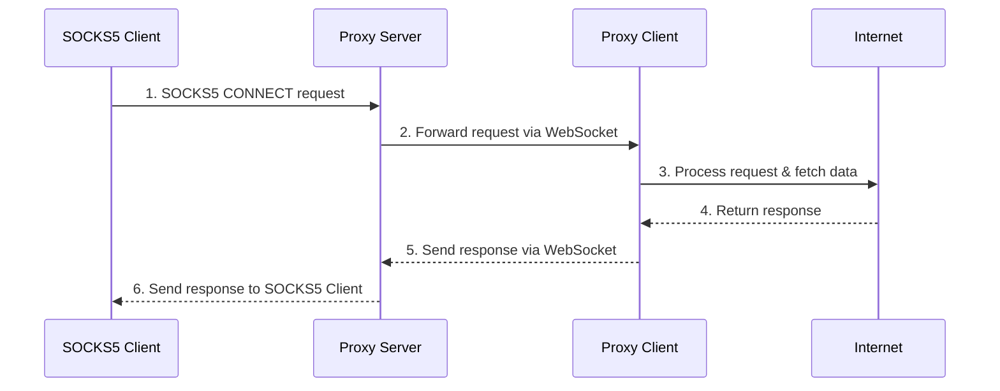

# Turbo

The solution for high-bandwidth residential proxies.

Earn passive Bitcoin rewards for sharing your unused Internet traffic.

## In Progress

This project is still at _Proof of Concept_ stage

1. [x] Client connection quality analysis
2. [ ] Crypto payment gateway
3. [ ] ~~Switching from WebSocket to gRPC~~
4. [ ] Chrome Extension for client
5. [ ] Automatic Bitcoin rewards

## Self-host

Run server, clients docker images

See stats at https://localhost:8080/stats

## Traffic flow

## Monetization

### Run a Node

Reward is `$0.01` per GB shared, that may seem low but the network is small so the handled bandwidth is high.

For example, a node shares 1 GB/s of bandwidth.
At the current price rate we can expect $0.01\$/sec = 432\$/month$ per device if running 24/7.

## Buy Bandwidth

Want to buy traffic from our network for web-scraping?

visit our website

[//]: # (Monetization is based on _connections_, requests that client performed successfully.)

## HWID Bans

 

