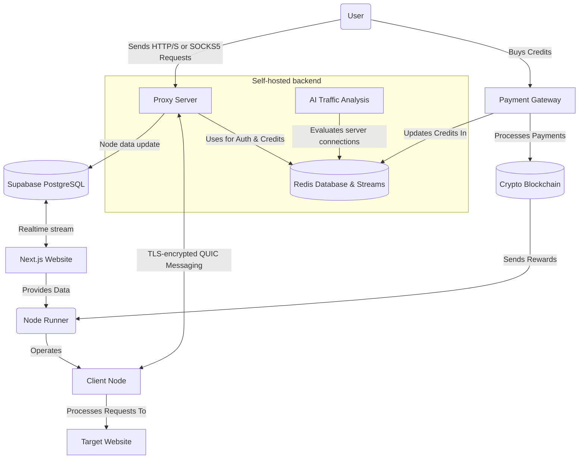
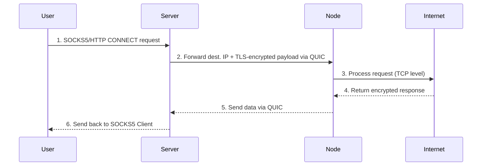

# Turbo

> **Fastest** and **cheapest** ~~decentralized~~ distributed HQ residential proxy network.

> [!WARNING]
> This project is in the **experimental** stage

## Features

1. [x] Node connection quality analysis
2. [x] Redis Auth & PUB/SUB (Credits, AI stream)
3. [ ] ~~Chrome Extension for client~~
4. [ ] AI abnormal traffic detection model

[//]: # (7. [ ] LLM Data Extraction with Cuelang)
## Global architecture

## Run a Node

The Turbo client node is a lightweight process that runs in the background and that lets you earn passive crypto rewards for sharing your unused Internet bandwidth.

#### Compatibility

| Platform | Supported |
|----------|-----------|
| Windows  | ✅         |
| macOS    | ✅         |
| Linux    | ✅         |
| Mobile   | ❌         |

#### Installation

- Download the [latest release](https://github.com/L1shed/Turbo/releases) for your platform.
- Open the downloaded executable — a new icon will appear in your system tray.
- Click on the icon and select **"Connect"** to pair with your account.

- A page will open, if authentication is successful, you will be redirected to the dashboard and your new node will appear in the nodes list.

  You can add an unlimited amount of nodes as long as they are on different networks/IPs.

🎉 Congratulations! Your node is now earning passively, check out your dashboard regularly

#### Monetization

Base reward is `$0.10` per GB shared but bonuses apply such as if:
* Your node has reached a daily connections streak over several days.
* Your node has a stable _long-term_ connection.

`$0.10` may seem low but the network is small, therefore the handled bandwidth per node is high.

For example, an average low-end node shares 0.05 GB/hour of bandwidth.
At the current price rate we get $3.72/month + bonuses **per node** if running 24/7, users can run multiple nodes on distinct devices.

#### Score calculation

Your node score is based on two factors:
- $L$: Latency, capped on a range from 10ms to 500ms
- $R$: Reliability

$$
S = w_L \cdot L + w_R \cdot R
$$

Where $w_L =$ 40% , $w_R =$ 60%

### Self-host a Server Node

You're free to operate your own server for commercial use according to the [Apache 2.0 license](LICENSE).

Run server docker image with `docker-compose up` and connect client nodes.

For more information, see [Setting Up Development Environment](.github/CONTRIBUTING.md#setting-up-development-environment)

## System Design

See [Global Architecture](#global-architecture) for a high-level overview of the system.

### Traffic flow

## Buy Bandwidth

Want to buy proxy access from our network for web-scraping?

* [**Telegram channel**](https://t.me/node_turbo)
* **Discord**: Find my Discord ID on my GitHub user profile page and DM me.

[//]: # (Join our [**Discord server**]&#40;https://discord.gg/ZqdvQkSEc7&#41; and create a ticket.)