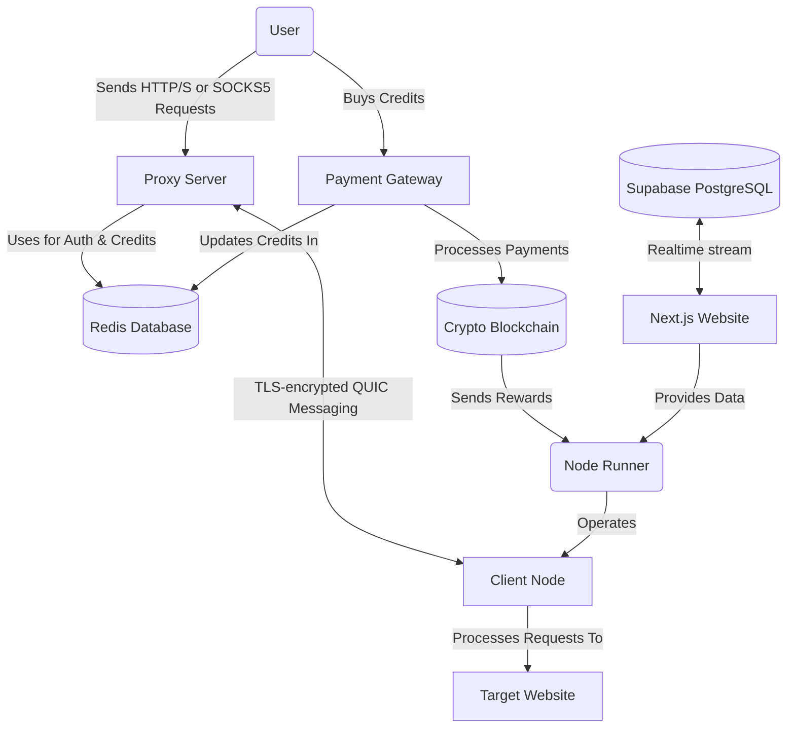
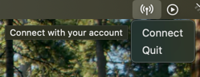
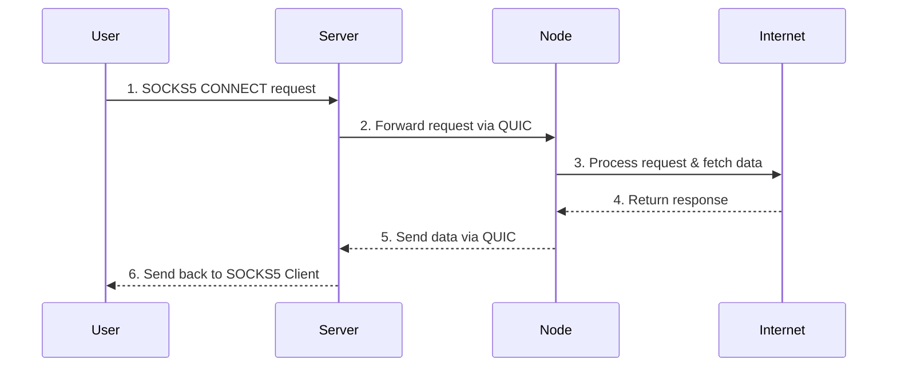

# Turbo

> **Fastest** and **cheapest** ~~decentralized~~ distributed residential Proxy network.

> [!WARNING]
> This project is in the **experimental** stage

## Features

1. [x] Client connection quality analysis
2. [x] Crypto payment gateway
3. [x] Redis Auth (proxy logins + GB credits)
4. [ ] ~~Chrome Extension for client~~
5. [ ] AI abnormal traffic detection model

[//]: # (7. [ ] LLM Data Extraction with Cuelang)

## Global architecture

## Monetization

Earn passive crypto rewards for sharing your unused Internet bandwidth.

### Run a Client Node

Start earning today by running client node in the background.

#### Compatibility

| Platform | Supported |
|----------|-----------|
| Windows  | ✅         |
| Linux    | ✅         |
| macOS    | ✅         |
| Mobile   | ❌         |

#### Installation

- Download the [latest release](https://github.com/L1shed/Turbo/releases) for your platform.
- Open the downloaded executable — a new icon will appear in your system tray.
- Click on the icon and select **"Dashboard"**.

- A page will open where you can link your wallet address via **WalletConnect** or enter it manually.

After that, you will be able to see your node(s) score, shared bandwidth and reward.

In fact, you can run several nodes on different devices/IPs with the same wallet.

### Reward

Base reward is `$0.10` per GB shared but bonuses may apply such as if:
* Your node has reached a daily connections streak over several days.
* Your node has a stable _long-term_ connection.

`$0.10` may seem low but the network is small, therefore the handled bandwidth per node is high.

For example, a node shares 0.2 GB/hour of bandwidth.
At the current price rate we get at least $14.64/month per device if running 24/7.

The reward is paid every day at 00:00 UTC (only if reward > $2).

### Score calculation

The score (up to 100) is based on two factors:
- $L$: Latency, capped on a range from 10ms to 500ms
- $R$: Reliability

$$
S = w_L \cdot L + w_R \cdot R
$$

Where $w_L =$ 60% , $w_R =$ 40%

### Self-host a Server Node

You're free to operate your own server for commercial use.

Run server docker image and connect clients.

For more information, see [Setting Up Development Environment](CONTRIBUTING.md#setting-up-development-environment)

## System Design

See [Global Architecture](#global-architecture) for a high-level overview of the system.

### Traffic flow

## Buy Bandwidth

Want to buy proxy access from our network for web-scraping?

* [**Telegram channel**](https://t.me/node_turbo)
* **Discord**: Find my Discord ID on my GitHub user profile page and DM me.

[//]: # (Join our [**Discord server**]&#40;https://discord.gg/ZqdvQkSEc7&#41; and create a ticket.)

## Data Privacy

We log anonymous data for each SOCKS5 connection to train AI models to detect abnormal and malicious traffic.