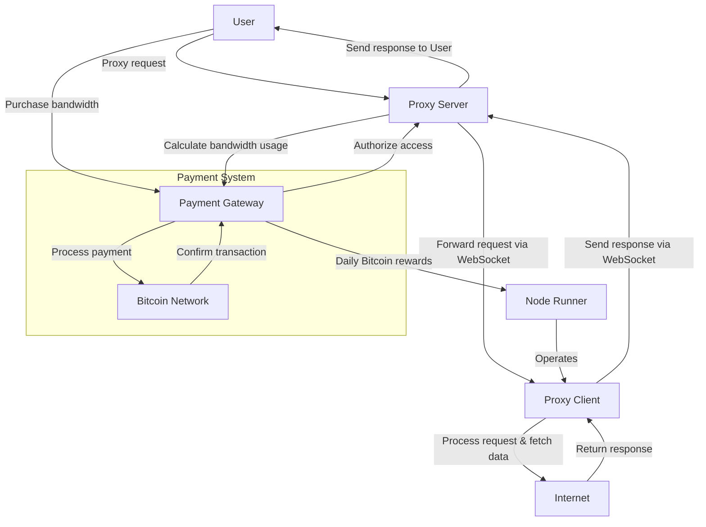

# Turbo

> **Fastest** and **cheapest** decentralized residential SOCKS5 Proxy network.


## In Progress

> [!NOTE]
> This project is still at _Proof of Concept_ stage

Here is a quick overview of the features:

1. [x] Client connection quality analysis
2. [x] Crypto payment gateway
3. [x] Redis auth for SOCKS proxy
4. [ ] ~~Switching from WebSocket to gRPC, QWIC or WebRTC~~
5. [ ] ~~Chrome Extension for client~~
6. [ ] Automatic Bitcoin rewards

## Architecture



## Monetization

### Run a Node

Earn passive Bitcoin rewards for sharing your unused Internet bandwidth.

### Reward

Reward is `$0.01` per GB shared, that may seem low but the network is small so the handled bandwidth is high.

For example, a node shares 1 GB/s of bandwidth.
At the current price rate we can expect $0.01\$/sec = 432\$/month$ per device if running 24/7.

The reward is paid in Bitcoin every day at 00:00 UTC (only if reward > 0.000,006 BTC).

### Score calculation

$$
S = w_L \cdot L + w_R \cdot R
$$
Where:
- $L$: Latency in ms
- $R$: Reliability

## Self-host Server Node

Run server docker image and connect clients.

See clients stats at https://localhost:8080/stats

## Traffic flow

[//]: # (```mermaid)

[//]: # (sequenceDiagram)

[//]: # (    participant SOCKS5_Client as SOCKS5 Client)

[//]: # (    participant Proxy_Server as Proxy Server)

[//]: # (    participant Proxy_Client as Proxy Client)

[//]: # (    participant Internet as Internet)

[//]: # ()
[//]: # (    SOCKS5_Client->>Proxy_Server: 1. SOCKS5 CONNECT request)

[//]: # (    Proxy_Server->>Proxy_Client: 2. Forward request via WebSocket)

[//]: # (    Proxy_Client->>Internet: 3. Process request & fetch data)

[//]: # (    Internet-->>Proxy_Client: 4. Return response)

[//]: # (    Proxy_Client-->>Proxy_Server: 5. Send response via WebSocket)

[//]: # (    Proxy_Server-->>SOCKS5_Client: 6. Send response to SOCKS5 Client)

[//]: # (```)


## Buy Bandwidth

Want to buy traffic from our network for web-scraping?

visit our website
discord or telegram
