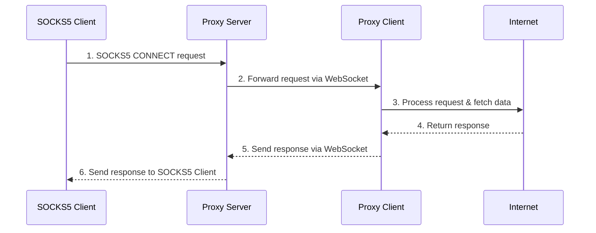

# Turbo

**Fastest** and **cheapest** decentralized residential SOCKS5 Proxy network.

## In Progress

This project is still at _Proof of Concept_ stage

1. [x] Client connection quality analysis
2. [x] Crypto payment gateway
3. [x] Redis auth for SOCKS proxy
4. [ ] ~~Switching from WebSocket to gRPC or QWIC~~
5. [ ] ~~Chrome Extension for client~~
6. [ ] Automatic Bitcoin rewards

## Self-host

Run server docker images and connect clients.

See clients stats at https://localhost:8080/stats

## Traffic flow

## Monetization

### Run a Node

Earn passive Bitcoin rewards for sharing your unused Internet bandwidth.

### Reward

Reward is `$0.01` per GB shared, that may seem low but the network is small so the handled bandwidth is high.

For example, a node shares 1 GB/s of bandwidth.
At the current price rate we can expect $0.01\$/sec = 432\$/month$ per device if running 24/7.

The reward is paid in Bitcoin every day at 00:00 UTC (only if reward > 0.000,006 BTC).

### Score calculation

$$
S = w_L \cdot 40L + w_R \cdot 60R
$$

Where:
- $L$: Latency in ms
- $R$: Reliability

## Buy Bandwidth

Want to buy traffic from our network for web-scraping?

visit our website

[//]: # (Monetization is based on _connections_, requests that client performed successfully.)

[//]: # (## HWID Bans)

 

