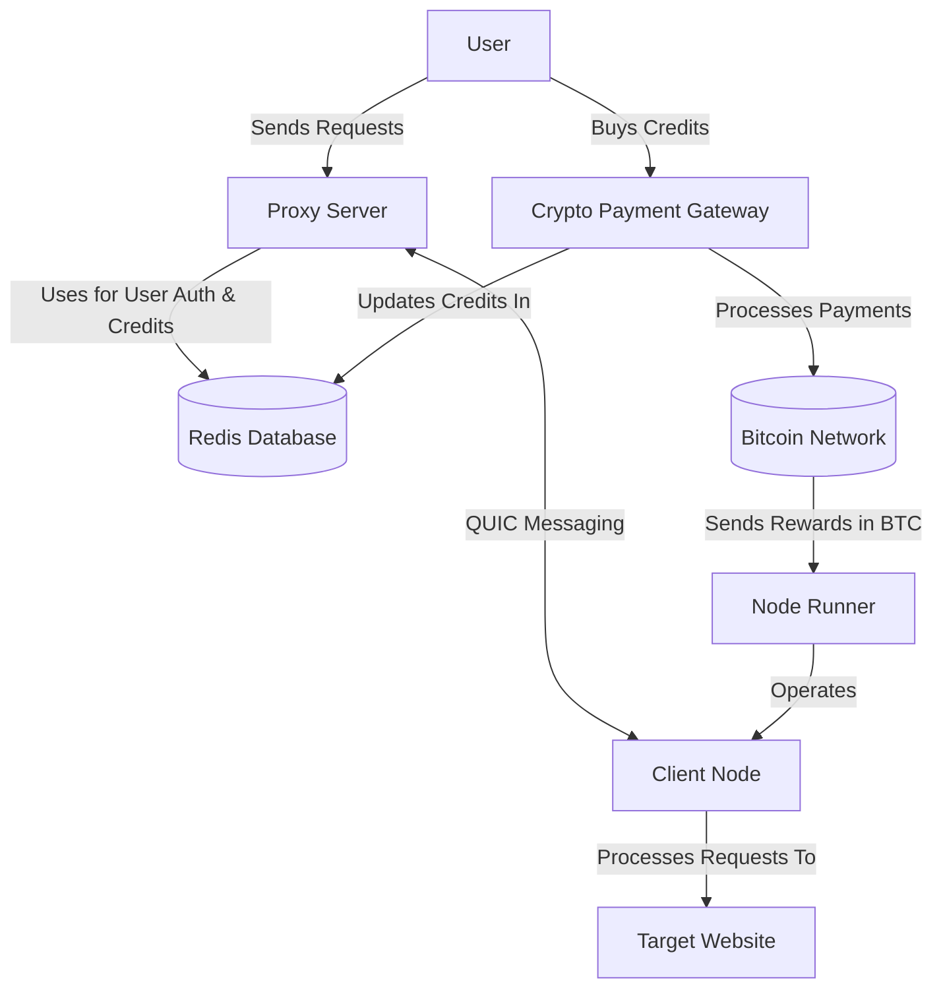

# Turbo

> **Fastest** and **cheapest** ~~decentralized~~ residential Proxy network.

> [!NOTE]
> This project is still at _Proof of Concept_ stage

Here is a quick overview of the features:

## Features

1. [x] Client connection quality analysis
2. [x] Crypto payment gateway
3. [x] Redis Auth (proxy logins + GB credits)
4. [ ] ~~Chrome Extension for client~~
5. [ ] Automatic Bitcoin rewards

### Global architecture

## Monetization

Earn passive Bitcoin rewards for sharing your unused Internet bandwidth.

### Run a Client Node

Start earning today by running client node in the background.

#### Compatibility

| Platform | Supported    |
|----------|--------------|
| Windows  | ✅            |
| Linux    | Console only |
| macOS    | ✅            |
| Mobile   | ❌            |

#### Installation

- Download the [latest release](https://github.com/L1shed/Turbo/releases) for your platform.
- Open the downloaded executable — a new icon will appear in your system tray.
- Click on the icon and select **"Dashboard"**.

- A page will open where you can link your wallet address via **WalletConnect** or enter it manually.

After that, you will be able to see your node(s) score, shared bandwidth and reward.

In fact, you can run several nodes on different devices/IPs with the same wallet.

### Reward

Reward is `$1.00` per GB shared, that may seem low but the network is small so the handled bandwidth is high.

For example, a node shares 0.1 GB/hour of bandwidth.
At the current price rate we can expect $73.2/month per device if running 24/7.

The reward is paid in Bitcoin every day at 00:00 UTC (only if reward > $5 in BTC).

### Score calculation

The score (up to 100) is based on two factors:
- $L$: Latency, capped on a range from 10ms to 500ms
- $R$: Reliability

$$
S = w_L \cdot L + w_R \cdot R
$$

Where $w_L =$ 60% , $w_R = $40%

### Self-host a Server Node

You're free to operate your own server for commercial use.

Run server docker image and connect clients.

See clients stats at https://localhost:8080/stats

## System Design

See [Global Architecture](#global-architecture) for a high-level overview of the system.

### Traffic flow

## Buy Bandwidth

Want to buy proxy access from our network for web-scraping?

Join our [Discord server](https://discord.gg/ZqdvQkSEc7) and create a ticket.